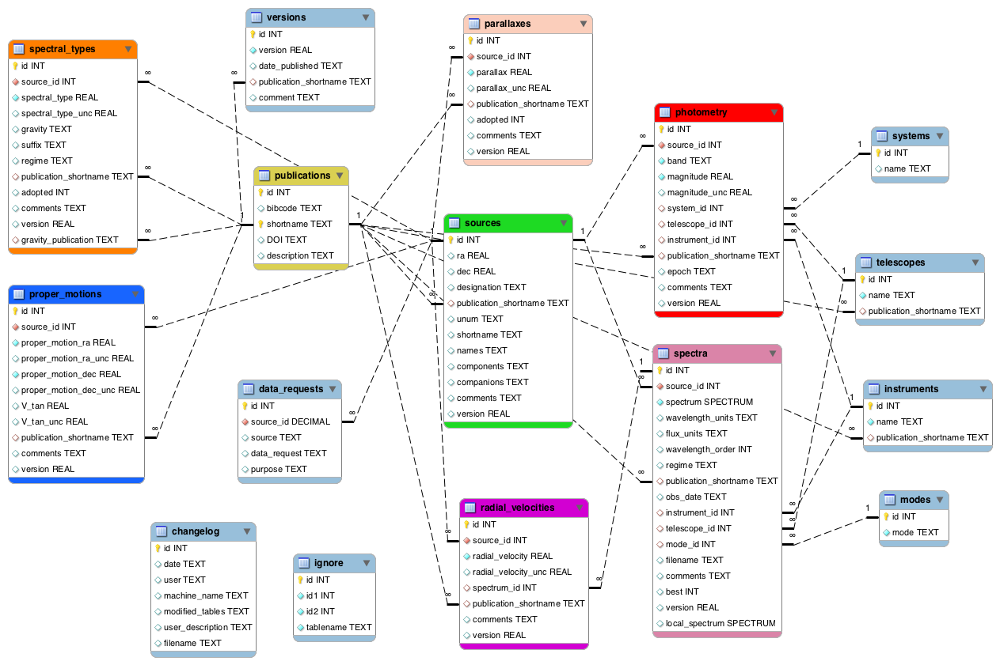

# BDNYC Database Tutorial
#### David R. Rodriguez   
February 24, 2017   

## Introduction

This is a short tutorial meant for the BDNYC database and how to use astrodbkit and AstrodbWeb with it.
You can read documentation on astrodbkit [here](http://astrodbkit.readthedocs.io/en/latest/index.html) 
and on AstrodbWeb [here](http://www.bdnyc.org/2016/03/astrodbweb/).

## Setting Up

I recommend copying the database (`bdnycdev.db`) from the Dropbox folder to 
somewhere else you can work on it.   
Most people will **not** have write access to the Dropbox database copy.   
Advanced users will instead grab the database from Github.

**NOTE**: For purposes of this tutorial, rename the database `temporary.db` as we will 
be editing and modifying records in it.

### Environment Creation
Worried about messing up your current version of astrodbkit and related python packages? 
Set up an environment first!
```bash
conda create -n db-tutorial python=2.7 matplotlib pandas flask bokeh
source activate db-tutorial
pip install astrodbkit
```

This will create a conda environment you can use for purposes of this tutorial and running the app.

### Astrodbkit Upgrade

You'll want to make sure you have a copy of the database and the latest version of astrodbkit 
(v0.6.3). To update astrodbkit, do:
```bash
pip install astrodbkit --upgrade
```

## Quick Overview of Our Database

The BDNYC database is a SQL database. 
We use Structured Query Language (SQL) to interface with it; specifically we use SQLite, which 
has a few minor differences to SQL.

Data in the database is stored in tables; each data point is an entry or row of a table. 
For example, one brown dwarf would be a specific row in the *sources* table. 
Photometry for that source would be one or more rows in the *photometry* table.

Each table has a number of columns, at least one of which is considered a **primary key**, 
which uniquely identified the row. In most of our tables, the primary key is `id`, 
which is stored as an integer.

In addition to primary keys, several tables have **foreign keys**. 
These are special columns in one table that have been linked to to 
primary keys from another table. 
For example, the `id` primary key of the *sources* table is used as a foreign key in the 
*spectra* table as the `source_id` column. You cannot add a spectrum to the *spectra* table 
for a `source_id` that does not exist, nor can you delete a row from the *sources* table if 
data exist for it in other tables.

While you can use pure SQL commands to interface with our database 
(eg, the sqlite3 and sqlalchemy packages for Python), 
**astrodbkit** has a variety of tools to allow you to access the database contents with ease.



## Loading the Database

Open python in the same directory as the database and load it with astrodbkit:
```python
from astrodbkit import astrodb
db = astrodb.Database('temporary.db')
```

You should get a message saying "Database ready for use".

In practice, you can open the database from anywhere by specifying the full path.

## Getting Help

#### db.info()

Use this method to see the full contents of the database. 
It will display all the tables and the number of entries for each table.
If you just type `db` you will get the output of `db.info()` as well as 
a mention to check `db.help()`.

#### db.help()

This method gives you a broad overview of what astrodbkit can do. 
It lists some of the more relevant methods you can use to interact with the database.

#### dir(db)

If you want the full list of available methods, you can use Python's built-in function `dir()`.

#### help(db.query)

If you want more information of a specific method, use Python's built-in `help()` feature.

#### db.schema()

When you need to double-check what columns are available for a specific table, 
use the `db.schema()` method:
```python
db.schema('sources')
```

## Getting the Information you Need

#### db.search()

Whenever you need to look up a quick value, use `db.search()`. 
This can be used to, for example, find the source_id for a specific object or 
the publication shortname for a specific paper. For example:
```python
db.search('0355', 'sources')
db.search('Cruz', 'publications')
```

Results can also be saved to a variable for use later:
```python
t = db.search('twa', 'sources', fetch=True)
print(len(t))
```

#### db.lookup()

This method performs `db.search()` on a list of criteria. 
You can use it if you have a list of sources to check or similar.   
I personally just loop over the list and manually run `db.search()` and related queries instead.

#### db.inventory()

Once you know a source's `id`, you can grab all the information about that source 
quickly by using this method:
```python
db.inventory(11)
```

You can also save the results to a variable, which ends up being a dictionary of astropy.Tables:
```python
t = db.inventory(11, fetch=True)
print(type(t), len(t), t.keys())
print(t['spectral_types'])
astrodb.pprint(t['spectral_types'])
```

#### db.query()

This is the workhorse of astrodbkit. 
It allows you send SQL queries to get the data you need.

**NOTE:** You can only use `db.query()` to get information (ie, SQL `SELECT` commands). 
For more general SQL commands (like `DELETE` or `UPDATE`), see `db.modify()`.

Default options return results as a numpy array:
```python
db.query('SELECT * FROM sources LIMIT 10')
```

Cleaner output can be found by setting the `fmt` flag:
```python
db.query('SELECT * FROM sources LIMIT 10', fmt='table')
db.query('SELECT * FROM sources LIMIT 10', fmt='dict')
db.query('SELECT * FROM sources LIMIT 10', fmt='pandas')
```

You can, of course, save the output to a variable and do your analysis on that:
```python
df = db.query("SELECT * FROM sources", fmt='pandas')
df.head() # getting first 5 results
```

##### Advanced pandas Example

For example, let's consider the case of joining and pivoting two tables:
```python
txt = "SELECT s.designation, p.source_id, p.band, p.magnitude " \
      "FROM photometry AS p JOIN sources AS s WHERE p.source_id=s.id " \
      "AND p.band LIKE '%2MASS%'"
df = db.query(txt, fmt='pandas')
# Examine the contents
df.head()
```

Pivot the table to get bands as columns:
```python
import pandas as pd
import numpy as np
df_pivot = pd.pivot_table(df, values='p.magnitude', index=['p.source_id','s.designation'], columns='p.band', aggfunc=np.mean)
df_pivot.head()
```

A little more manipulation to make the DataFrame pretty:
```python
df_pivot.reset_index(inplace=True)
df_pivot.index = df_pivot['p.source_id']
df_pivot.drop('p.source_id', axis=1, inplace=True)
df_pivot.head()
```

##### Spectrum objects

Querying the *spectra* table will automatically convert spectra to `Spectrum` 
objects using astropy routines. 
By using `use_converers=False`, we can query the *spectra* table **without** converting 
the spectra to `Spectrum` objects (useful for examining results):
```python
db.query("SELECT id, spectrum FROM spectra WHERE spectrum LIKE 'http%' LIMIT 5", use_converters=False, fmt='pandas')
```

Let's grab one of these spectra to examine them further:
```python
t = db.query("SELECT spectrum FROM spectra WHERE id=3", fmt='dict', fetch='one')
print(t.keys())
print(t['spectrum'])
```

The spectrum has been loaded as a `Spectrum` object which has three main parts:
```python
print(t['spectrum'].path)
t['spectrum'].header
print(t['spectrum'].data)
```

The data is stored in `Spectrum.data` as a set of 2-3 numpy arrays, where 0=wavelength, 1=flux, 2=error:
```python
print(len(t['spectrum'].data))
import matplotlib.pyplot as plt
w, f = t['spectrum'].data[0], t['spectrum'].data[1]
plt.plot(w, f)
```

For a quick spectrum plot, you can also use astrodbkit's built-in plotting:
```python
db.plot_spectrum(3)
```

##### Some Specialized Queries

#### db.references()

Using this to an overview of what content there is for a specific reference:
```python
db.references('Cruz03')
```

#### db.get_bibtex()

This specialized method will query NASA ADS for the bibtex of a 
specified publication in our table:
```python
db.get_bibtex('Fahe16')
```

## Adding to and Modifying the Database

Make sure you are running on a temporary copy of the database before 
making these changes (use `db.info()` to check what file was loaded).

#### db.add_data()

This method is used to add records to the database, from either an external 
file or from a Python object. We'll do it the later way to avoid creating 
a file.   
The Python object is a **list of lists;** the first list must be the column names. 
The subsequent lists will be the actual values you want to add.

Let's add two objects with ra, dec, publications, and a comment.
First, we'll create the object:
```python
data = list()
data.append(['ra','dec','publication_shortname','comments']) # columns
data.append([123, -12, 'Rodr17', 'fake star'])
data.append([1, 1, 'Fahe16', 'second fake star'])
print(data)
```

Now, we'll add those two entries to the *sources* table:
```python
db.add_data(data, 'sources')
```

You *will* get an error: `IntegrityError: FOREIGN KEY constraint failed`

The reason for this is that Rodr17 is not a valid publication; 
it does not already exists in the *publications* table. 
In practice, one would go back and add 
this entry to *publications* and then go back and add the new sources. For now, we 
will just rewrite the `data` variable to use a real publication:
```python
data = list()
data.append(['ra','dec','publication_shortname','comments']) # columns
data.append([123, -12, 'Cruz03', 'fake star'])
data.append([1, 1, 'Fahe16', 'second fake star'])
print(data)
```

Now we can add them: `db.add_data(data, 'sources')`

Spectra is added in the same way, but the `spectrum` column would be the 
path to the spectrum. That is, it would be a string of the url or a path to 
the Dropbox BDNYC_spectra folder.

#### db.modify()

This method can be used to run any valid SQLite command, including those 
to delete tables or entries or to insert or modify records. It should be used 
with caution. For now, we will only cover how to modify records.

Let's add a designation to our fake stars. First, we'll find their `id` 
with `db.search()` and then use `db.modify()` to update the record:
```python
db.search('fake', 'sources')  # my fake stars were id=1855, 1858
db.modify("UPDATE sources SET designation='Number 1' WHERE id=1855")
db.modify("UPDATE sources SET designation='2nd Best' WHERE id=1858")
```

You can send multiple `id`s at time as well as change more than one field at a time:
```python
db.modify("UPDATE sources SET shortname='fake', version=9 WHERE id IN (1855,1858)")
```

Advanced users may note how easy it can be too loop over imported data and use it 
to modify the database or create a structure of new data to be added.

Now, let's delete the records we just added.
```python
db.modify("DELETE FROM sources WHERE id IN (1858, 1855)")
```

#### db.add_changelog()

Use this to add an entry to the changelog table. You'll need to provide name, table, and a comment:
```python
db.add_changelog("David Rodriguez", "SOURCES", "Added 2 fake sources")
```

#### db.save()

Advanced users who wish to routinely make changes to the database will use 
the `db.save()` to generate ascii versions of all the data for purposes of version 
controlling.   
For now, we'll just try it out and see what it does:
```python
db.save()
```

By default, this will create a directory `tabledata/` in your current working directory and 
will populate it with the contents of the database.   
That folder should contain a lot .sql files, each named after the individual tables.

#### db.snapshot()

With this method, you can export a snapshot of the database. 
For example, to recover version 1.0, the database published in Filippazo et al. 2015, you can do:
```python
db.snapshot(name_db='export_v1.db', version=1.0)
```

Soon you'll be able to set version=2.0 to get the newest version of the public database, 
which includes data from Faherty et al. 2016 and Cruz et al. 2017.

## Running AstrodbWeb

The AstrodbWeb application can be used to readily explore the database and 
its contents in graphical form without having to directly use Python.

To start, we'll grab the app from 
[https://github.com/dr-rodriguez/AstrodbWeb](https://github.com/dr-rodriguez/AstrodbWeb)

Download that to any place and extract it. It should create an AstrodbWeb folder.

In that folder, remove the database.db file and replace it with your copy of the database, renamed to `database.db`.   
Alternatively you can use `ln` to create soft links to, say, the Dropbox copy of the database:
```bash
ln -s ~/Dropbox/BDNYCdb/bdnycdev.db database.db
```

To run, make sure you have activate the db-tutorial environment 
(you may already be on it for purposes of this tutorial):   
`source activate db-tutorial`

Make sure you have installed the packages from requirements.txt:
`pip install -r requirements.txt`

And then run the `runapp.py` file with python:   
`python runapp.py`

That will start up the application, which by default runs in `http://0.0.0.0:5000/`   
You can point your browser to that url and use your local app now.

For convenience, I have provided a script to do this automatically for you.   
If you open and edit the script (using emacs, Sublime, TextWranger, etc), 
you will see:
```bash
#!/usr/bin/env bash

# Activate the application environment
source activate db-tutorial

# Open the default web browser to the local app
open http://0.0.0.0:5000/
# You will need to refresh when the app finishes loading

# Navigate to the directory in which the app can be found
cd /Users/strakul/PycharmProjects/bdnyc_webapp

# Load the application
python runapp.py
```
You will want to edit the path to where you installed AstrodbWeb.
You will also want to make it executable:   
`chmod a+x AstrodbWeb`   
as well as set the Default Application for it to be Terminal 
(use `command+i` or right click for this).

When all set you should be able to double click this to open up the website and 
load the app.   
You will have to refresh the page after a few seconds since it gets 
opened before the app fully loads.

To **close** the app you will want to do `ctrl+c` on the terminal running it to kill the process.   
Closing the browswer will not stop the app and as long as it is running it will keep the port occupied 
(so you won't be able to open another instance of it).   
If you closed the terminal without killing the process, you can type `top` on a terminal window to see 
what's running. If you find a python or python2.7 process, you can then use `kill` with the PID to 
terminate the process. 
If you have more than one, it may be tricky to determine which is the correct one to kill, 
so I recommend always saving your work.
